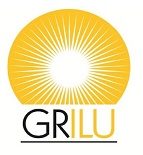

 
   

 
# Grilu - Grupo de Pesquisa em Iluminação 
O Grupo de Pesquisa em Iluminação (GRILU), criado em 20 de maio de 2004 no Centro de Tecnologia da UFAL, dentre outros objetivos, faz: (i) investigações relacionadas à iluminação natural, à iluminação artificial e à eficiência energética na edificação e (ii) programas de computador e aplicativos de celular (multiplataforma) de apoio ao ensino (graduação e pós-graduação), à pesquisa e ao projeto do conforto ambiental no ambiente construído. A principal realização do grupo é o programa TropLux, que simula a iluminação natural no ambiente construído.

## Grilu Mineração
Repositório com pastas e subpastas com o objetivo de funcionar como um banco de dados segmentados voltados para luz e iluminação. 

### Índice de tópicos de luz/iluminação
+ [Luz (Conceitos introdutórios)](/luz-conceitos-introdutorios.md)
+ [Benefícios da luz natural](/free-programming-books-ar.md)
+ [Fontes de luz natural](/free-programming-books-ar.md)
+ [Visão](/free-programming-books-ar.md)
+ [Conforto visual](/free-programming-books-ar.md)
+ [Métodos de cálculo da iluminância](/free-programming-books-ar.md)
+ [Sistemas de iluminação natural](/free-programming-books-ar.md)
+ [Equipamentos de medição da iluminância](/free-programming-books-ar.md)
